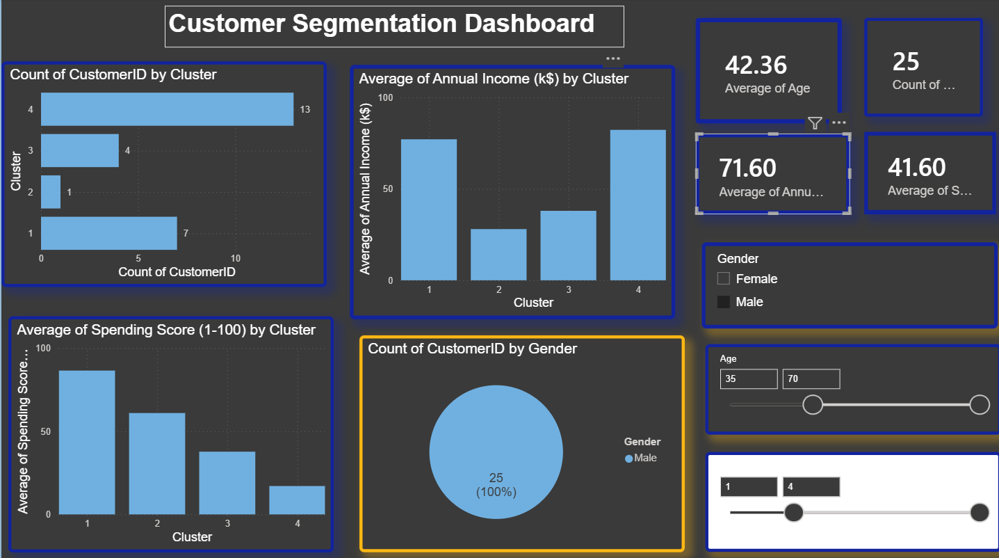
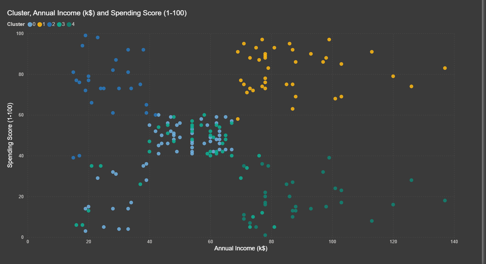

# 🛍️ Customer Segmentation using K-Means Clustering

## 📌 Overview

This project applies the **K-Means Clustering** algorithm to segment mall customers based on their **Annual Income** and **Spending Score**. The clustered data is visualized through an interactive **Power BI dashboard**, enabling businesses to better understand customer behavior and support targeted marketing strategies.

---

## 🚀 Objectives

- Analyze customer demographics and spending patterns.
- Perform customer segmentation using K-Means Clustering.
- Identify meaningful customer groups.
- Build an interactive Power BI dashboard for business insights.

---

## 🛠️ Technologies Used

- Python
- Pandas
- NumPy
- Matplotlib
- Scikit-learn
- Jupyter Notebook
- Power BI

---

## 📂 Project Structure

```text
Customer-Segmentation/
│
├── dataset/
│   ├── Mall_Customers.csv
│   └── Customer_Segments.csv
│
├── notebooks/
│   └── Customer_Segmentation.ipynb
│
├── powerbi/
│   └── CustomerSegmentation.pbix
│
├── images/
│   ├── dashboard.png
│   ├── elbow_method.png
│   └── cluster_plot.png
│
├── README.md
└── requirements.txt
```

---

## 📊 Dashboard Features

- 👥 Total Customers
- 🎂 Average Age
- 💰 Average Annual Income
- ⭐ Average Spending Score
- 📊 Customers by Cluster
- 🥧 Customers by Gender
- 📈 Average Income by Cluster
- 📉 Average Spending Score by Cluster
- 🎛️ Interactive Filters (Cluster, Gender, Age)

---

## 📷 Project Preview

### Power BI Dashboard



### Elbow Method


### Customer Segments



---

## 📈 Business Insights

- Segmented customers into distinct groups using K-Means Clustering.
- Identified customer behavior based on income and spending patterns.
- Developed an interactive dashboard to support business decision-making.
- Enabled customer analysis through dynamic filters and visualizations.

---

## ▶️ How to Run

1. Clone the repository.

```bash
git clone https://github.com/laharin-p/Customer-Segmentation.git
```

2. Install the required libraries.

```bash
pip install -r requirements.txt
```

3. Open **Customer_Segmentation.ipynb** to run the clustering analysis.

4. Open **CustomerSegmentation.pbix** in **Power BI Desktop** to explore the dashboard.

---

## 🎯 Skills Demonstrated

- Data Cleaning
- Exploratory Data Analysis (EDA)
- K-Means Clustering
- Customer Segmentation
- Data Visualization
- Power BI Dashboard Development
- Business Analytics

---

## 👨‍💻 Author

**Pathan Laharin**

Aspiring Data Analyst | Python | SQL | Power BI | Machine Learning

**GitHub:** https://github.com/laharin-p

⭐ If you found this project useful, consider giving it a **Star**!
